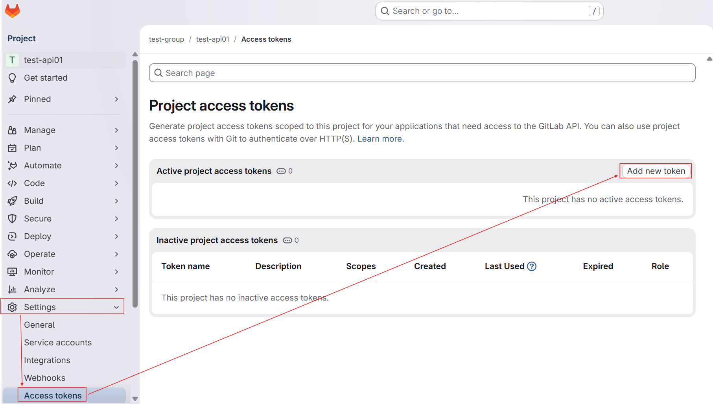
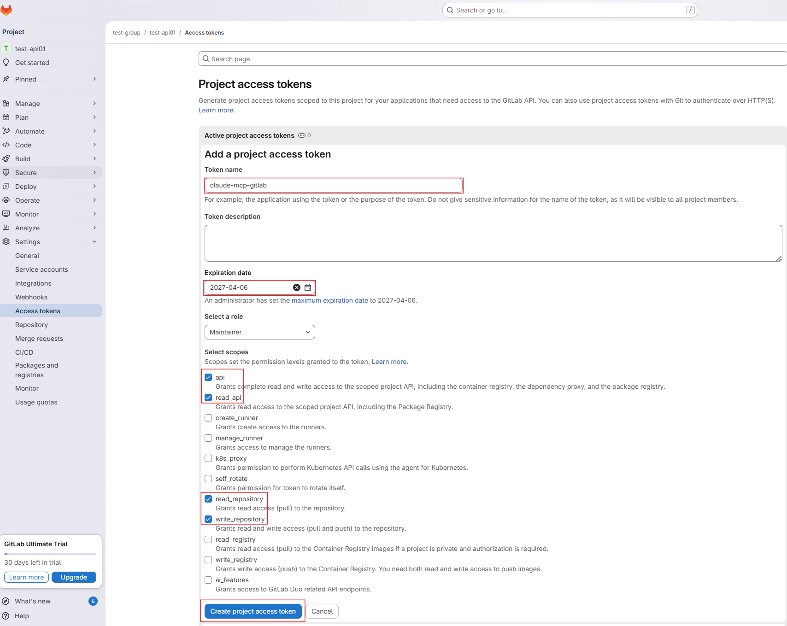
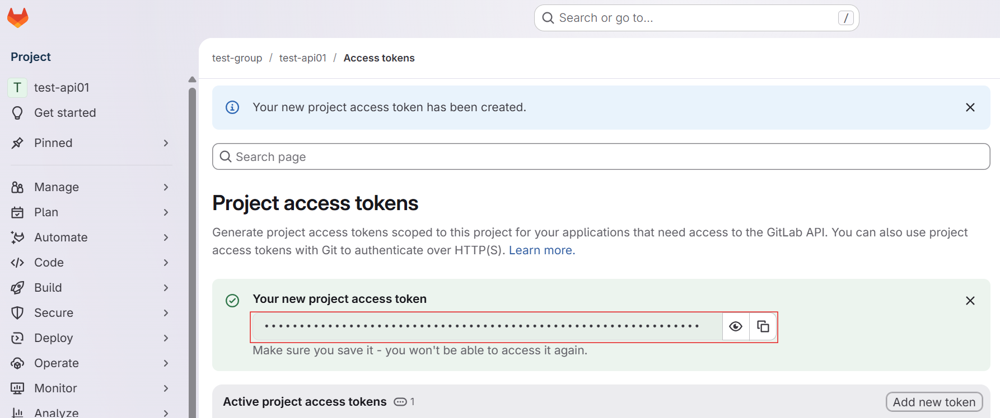
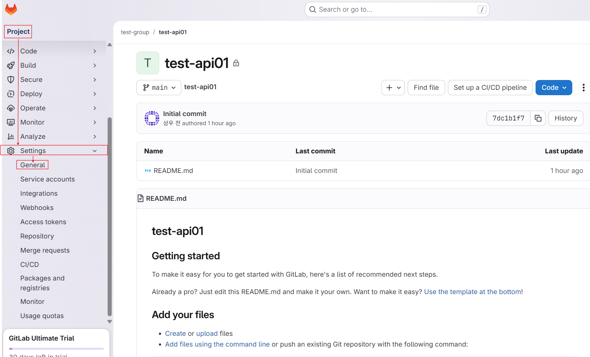
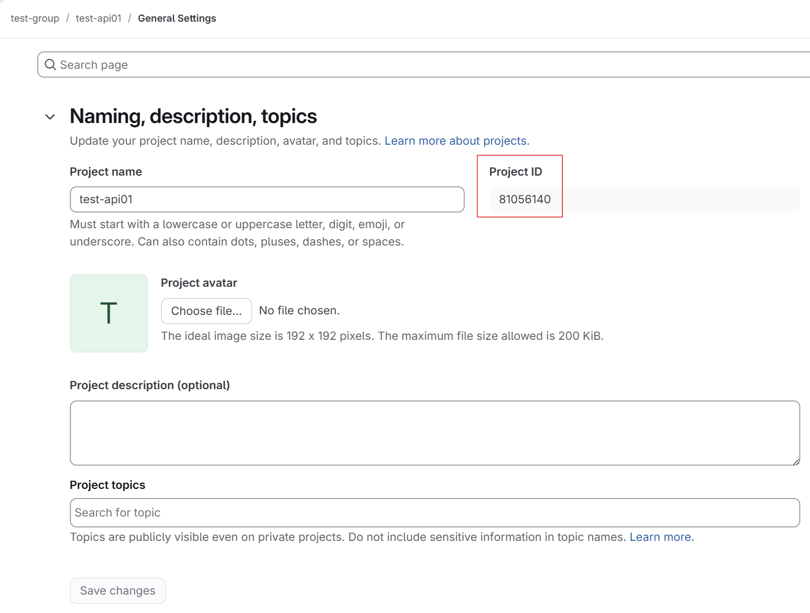
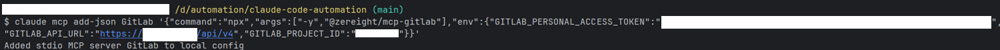
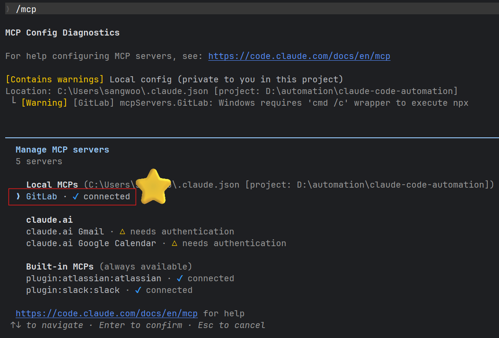
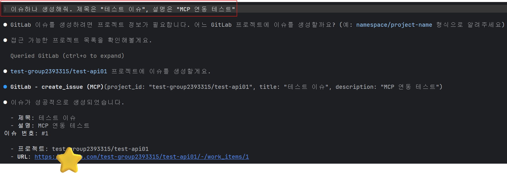
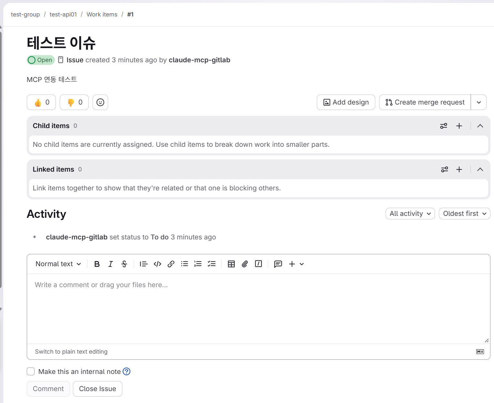

# Gitlab MCP

### 1. Personal Access Token(PAT) 생성
- gitlab 접속 및 로그인 > Settings > Access tokens > Add new token을 통한 PAT 생성





### 2. Project ID 확인



### 3. MCP 추가
- 명령어 예시
```shell
$ claude mcp add-json GitLab '{"command":"npx","args":["-y","@zereight/mcp-gitlab"],"env":{"GITLAB_PERSONAL_ACCESS_TOKEN":"토큰값","GITLAB_API_URL":"https://깃랩주소/api/v4","GITLAB_PROJECT_ID":"프로젝트ID"}}'
```
- 명령어 실행 및 결과


- mcp 연결 상태 확인
  ```shell
  $ claude
  claude$ /mcp
  ```


### 4. Test
- 이슈 생성 요청
  ```shell
  claude$ 이슈하나 생성해줘. 제목은 "테스트 이슈", 설명은 "MCP 연동 테스트"
  ```
  



- 활용 추가 예시
  ```shell
  claude$ 열려있는 이슈 목록 보여줘
  claude$ 000 이슈 000 담당자로 변경해줘
  claude$ 현재 열려있는 MR 목록이랑 각 MR 상태 요약해줘
  claude$ 000 브랜치에서 000 브랜치로 MR 만들어줘. 제목은 "000"
  등등..
  ```

