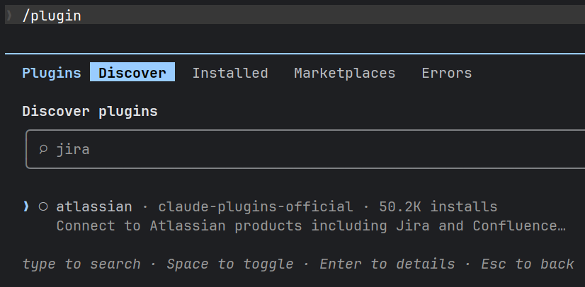
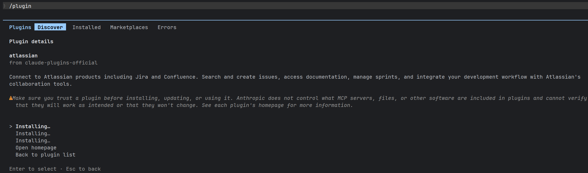
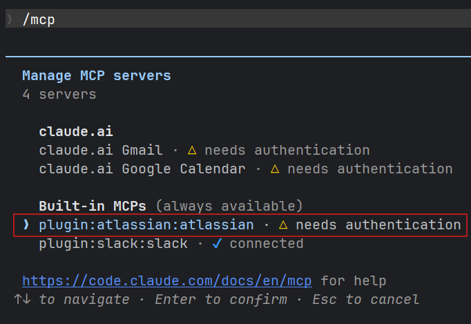
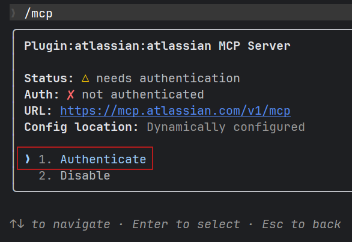
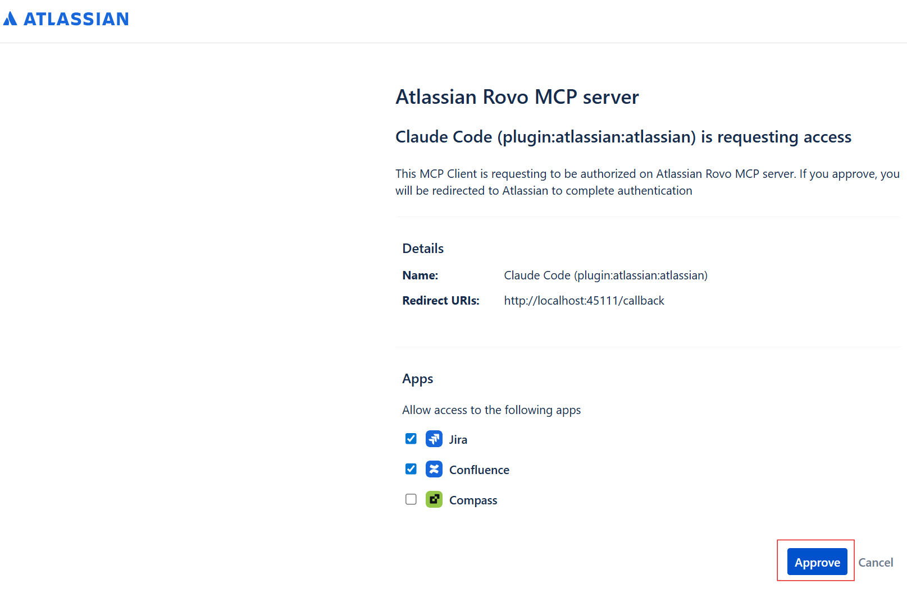
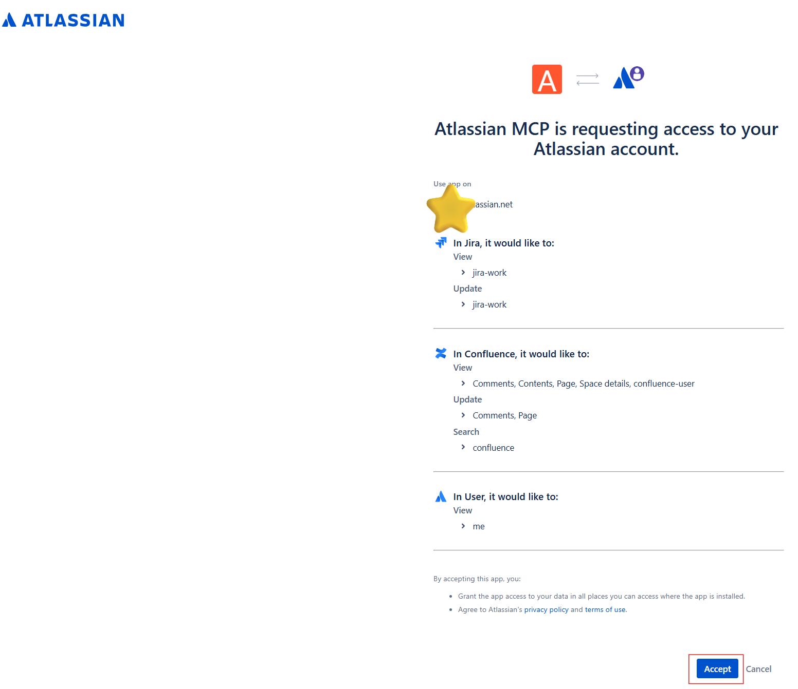
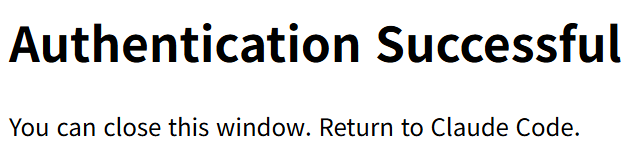
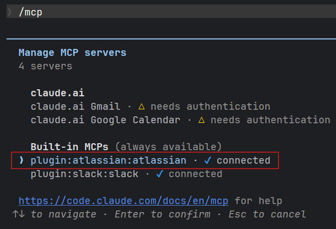
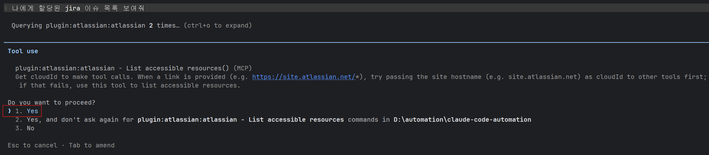
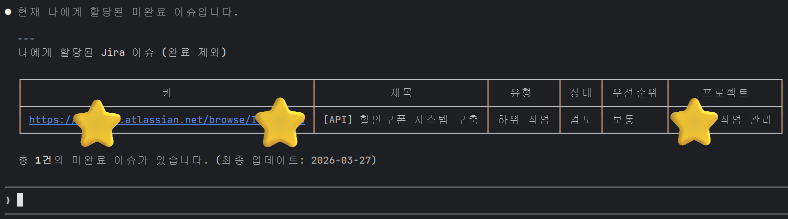

# Jira MCP

### 1. 플러그인 설치 및 설정
- claude code 실행
  ```shell
  $ claude
  ```
- plugin 설정 접속
  ```shell
  claude$ /plugin
  ```
- atlassian(jira) plugin 검색 및 설치
  - jira 검색 → 결과 목록에서 방향키 ↓ 로 선택 → 스페이스바 + 엔터
  - scope 선택(user, project, local)하여 설치<br><br>
  
  

### 2. MCP 권한 설정
- claude code 재실행(필수): 플러그인 설치 후 mcp 목록에 즉시 미반영
  ```shell
  $ claude
  ```
- mcp 설정 접속
  ```shell
  claude$ /mcp
  ```
- mcp 권한 허용
  - plugin:atlassian:atlassian 선택 → 엔터
  - Authenticate 선택 → 엔터
  - 로그인 후 권한 허용 동의<br><br>

  
  
  
  
  

- 완료 확인: 재실행 후 /mcp 로 연결 상태 확인
  ```shell
  $ claude
  claude$ /mcp 
  ```

  

### 3. Test
- 나에게 할당된 이슈 조회
  ```shell
  claude$ 나에게 할당된 Jira 이슈 목록 보여줘
  ```

  
  

- 활용 추가 예시
  ```shell
  claude$ 000 프로젝트에서 In Progress 상태인 이슈 목록 알려줘
  claude$ 000 이슈 상태를 Done으로 변경해줘
  claude$ 000 프로젝트에 새 이슈 만들어줘 - 제목: 000, 설명: 000
  등등..
  ```