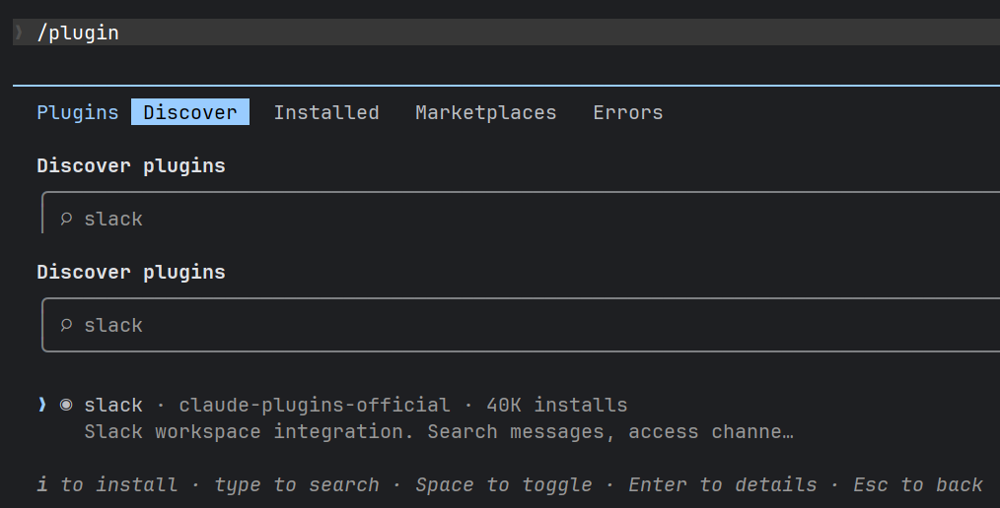
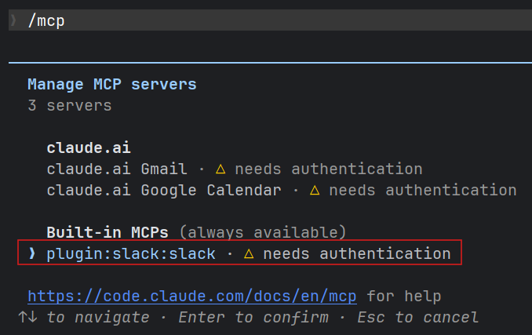
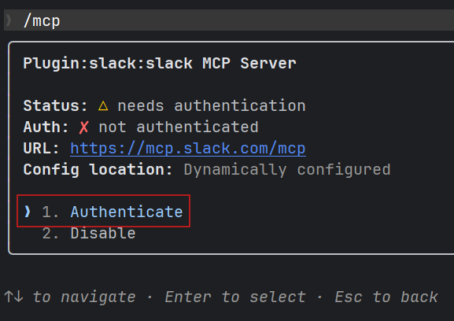
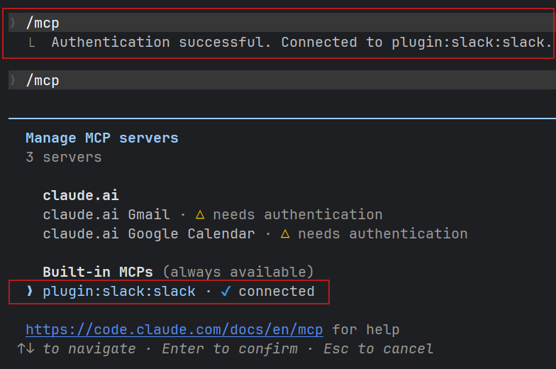
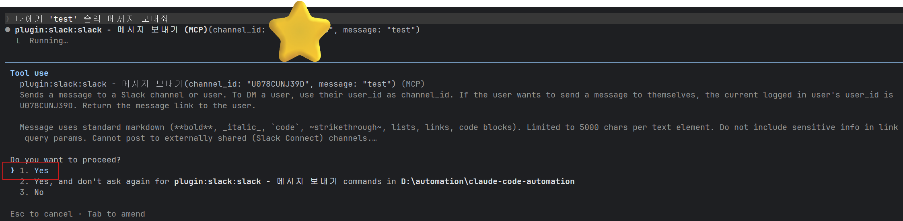

# Slack MCP

### 1. 플러그인 설치 및 설정
- claude code 실행
  ```shell
  $ claude  
  ```
- plugin 설정 접속
  ```shell
  claude$ /plugin
  ```
- slack plugin 검색 및 설치
  - slack 검색 → 결과 목록에서 방향키 ↓ 로 선택 → 스페이스바 + 엔터
  - scope 선택(user, project, local)하여 설치



### 2. MCP 권한 설정
- claude code 재실행(필수): 플러그인 설치 후 mcp 목록에 즉시 미반영
  ```shell
  $ claude
  ```
- mcp 설정 접속
  ```shell
  claude$ /mcp
  ```
- mcp 권한 허용
  - plugin:slack:slack 선택 → 엔터
  - Authenticate 선택 → 엔터
  - 로그인 후 권한 허용 동의





- 완료 확인: 재실행 후 /mcp 로 연결 상태 확인
  ```shell
  $ claude
  claude$ /mcp 
  ```
  

### 3. Test
  ```shell
    claude$ 나에게 'test' 슬랙 메세지 보내줘
  ```
  

  

  ```shell
    claude$ 000 채널에서 000 | 000 키워드에 해당되는 내용 요약해서 전달해줘
    claude$ 000 채널에서 내가 작성한 게시글 20개만 전달해줘
    등등..
  ```