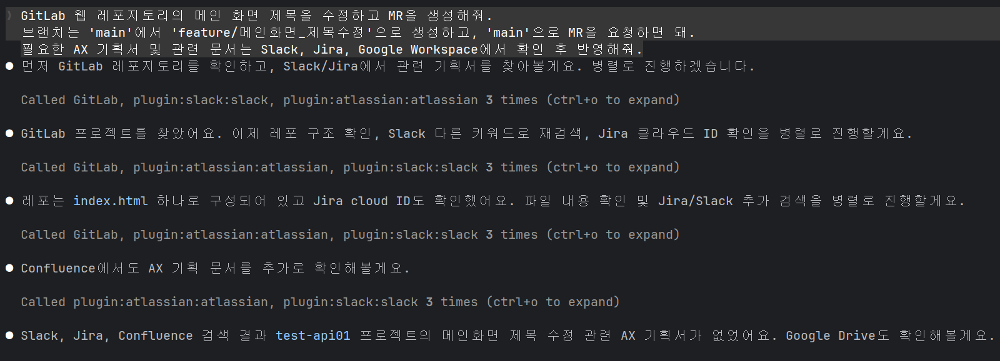
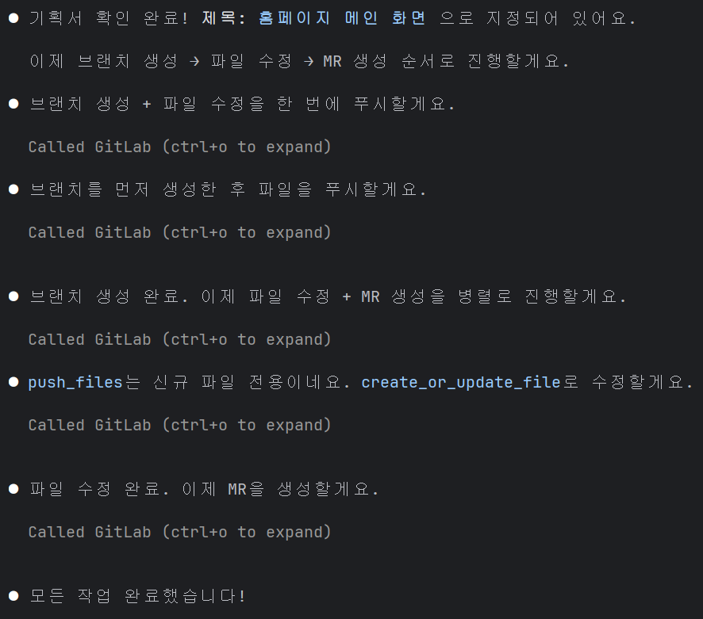
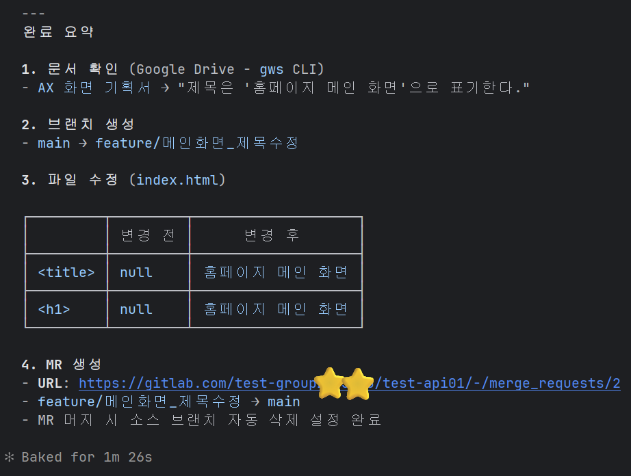
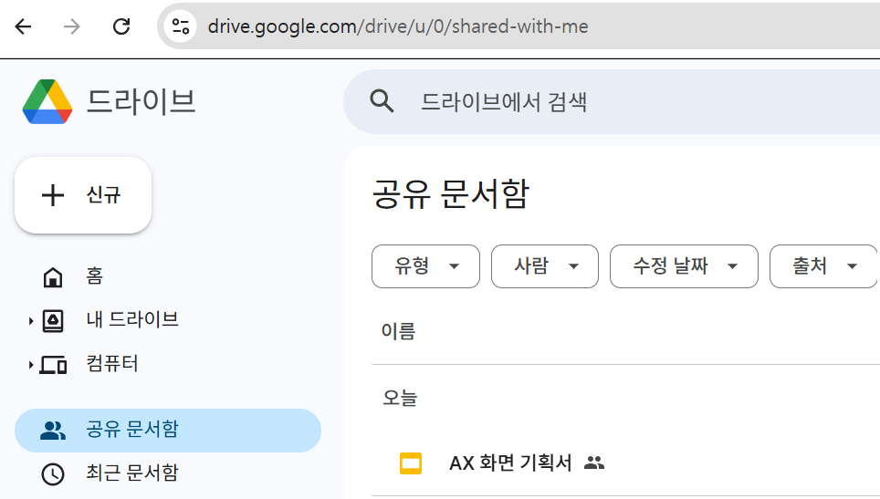
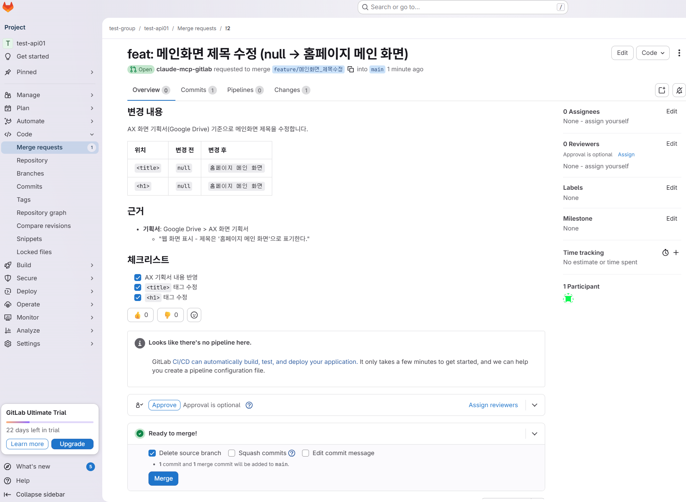

# 코드 수정 자동화 Workflow

> **목적** : 관련 기획 문서를 기반으로 근거 있는 코드 수정 후 MR까지 자동 생성  

> **핵심 흐름** : 문서 수집 → 변경 범위 확정 → 코드 수정 → MR 생성

---

### 1. 필요 도구

| MCP / 도구 | 역할 | 설정 문서 |
|------------|------|-----------|
| GitLab MCP | 브랜치 생성, 파일 수정, MR 생성 | [gitlab.md](../mcp/gitlab.md) |
| Slack MCP | 관련 논의 및 결정사항 검색 | [slack.md](../mcp/slack.md) |
| Jira MCP | 요구사항·이슈 티켓 확인 | [jira.md](../mcp/jira.md) |
| gws CLI | Google Drive·Docs 기획서 검색 | [googleworkspace-windows.md](../mcp/googleworkspace-windows.md) |

---

### 2. Workflow

#### Step 1. 관련 문서 · 이슈 수집 (병렬 탐색)
- Slack, Jira, Google Workspace에서 관련 문서 탐색
- 변경 요청의 근거 및 요구사항 확보

---

#### Step 2. 변경 범위 파악
- 수집된 문서를 기반으로 수정 대상 및 범위 확정
- 영향도 있는 파일 및 로직 식별

---

#### Step 3. 브랜치 생성 및 코드 수정
- `main` 기준으로 feature 브랜치 생성
- 변경 범위에 따라 코드 수정 수행

---

#### Step 4. MR 생성
- `main` 브랜치로 Merge Request 생성
- 변경 내용 및 근거를 MR에 포함

---

### 3. 활용 예시

```shell
claude$ GitLab 웹 레포지토리의 메인 화면 제목을 수정하고 MR을 생성해줘.
         브랜치는 main에서 feature/메인화면_제목수정으로 생성하고,
         main으로 MR을 요청하면 돼.
         필요한 AX 기획서 및 관련 문서는 Slack, Jira, Google Workspace에서 확인 후 반영해줘.
```







---